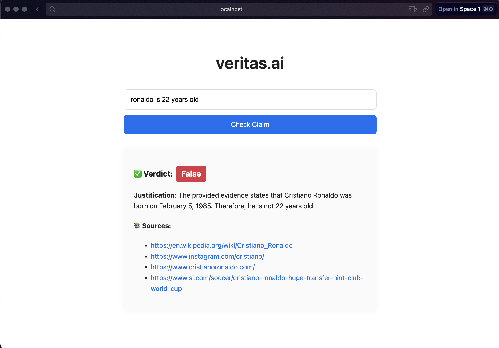

# Veritas.ai

> A lightweight, web-based fact-checker for sports news claims.  
> Deployed on Vercel: https://vertias-aii.vercel.app/

  

---

## What It Does

- **Submit a Claim**: Enter any sports-related statement (e.g., “Ronaldo is 22 years old”).  
- **Get a Verdict**: “True” or “False” based on scraped evidence.  
- **See Justification**: A concise explanation.  
- **View Sources**: URLs consulted during verification.

> Support for non-sports news coming soon.

---

## Tech Stack

- **Backend**: FastAPI (Python 3.8+), Uvicorn, Pydantic  
- **Frontend**: Next.js (React), Tailwind CSS (or custom CSS)  
- **Scraping/NLP**: `requests`, `BeautifulSoup4`, simple rule-based checks  
- **Deployment**: Vercel (Frontend + FastAPI serverless functions)

---

